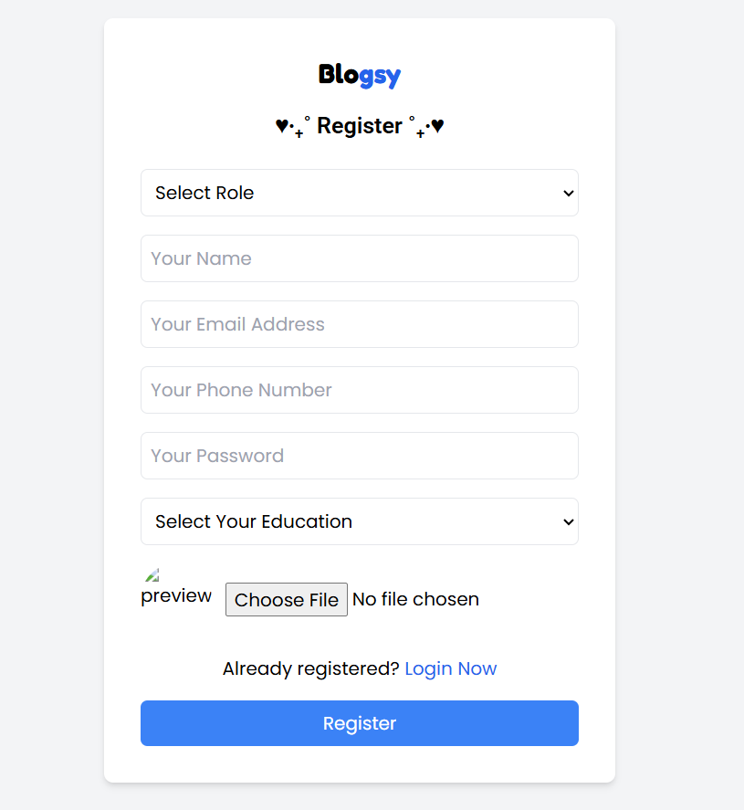
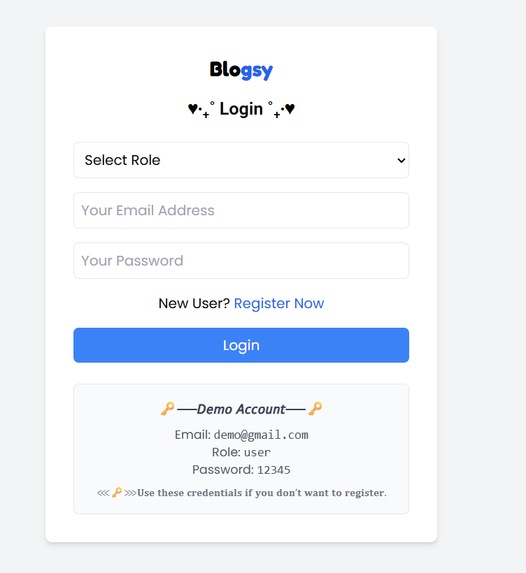
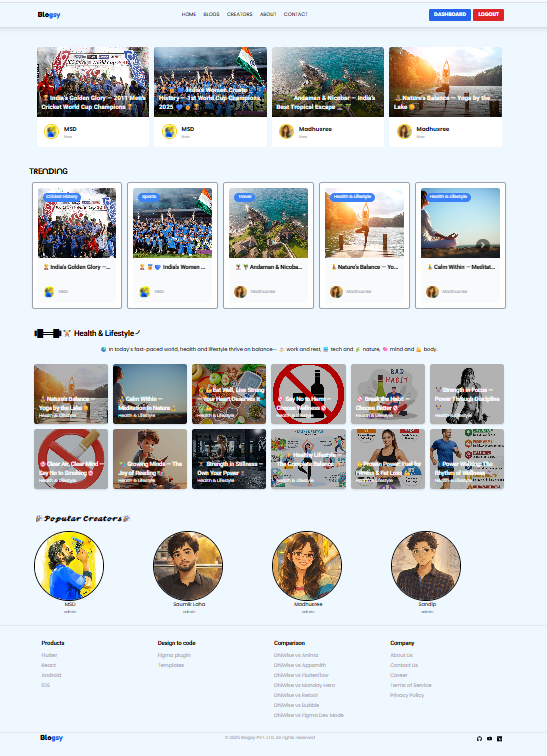
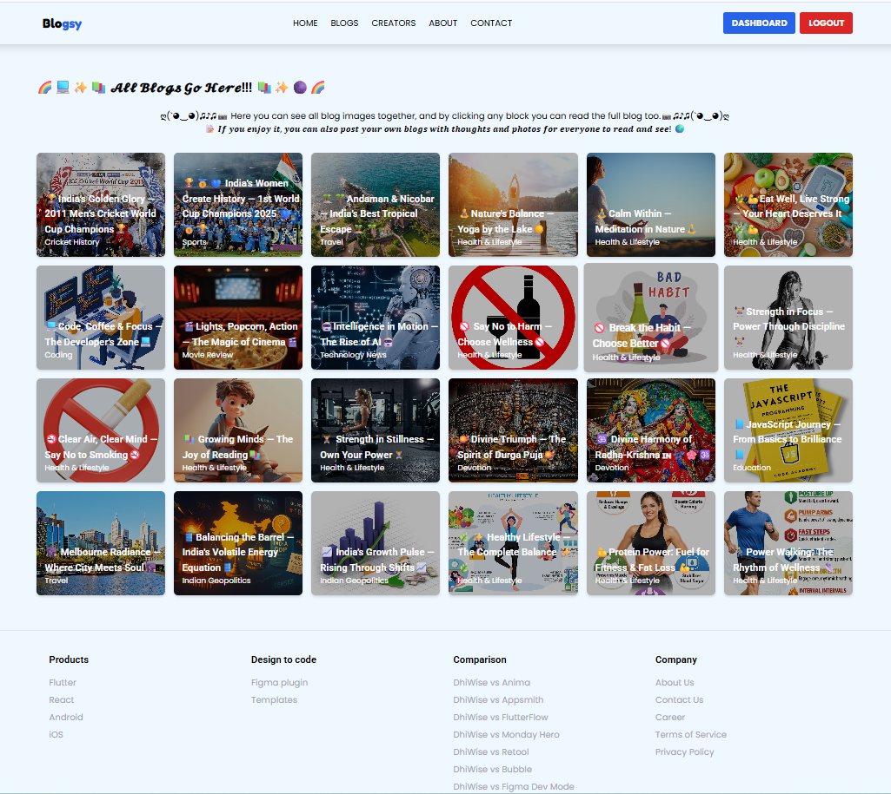
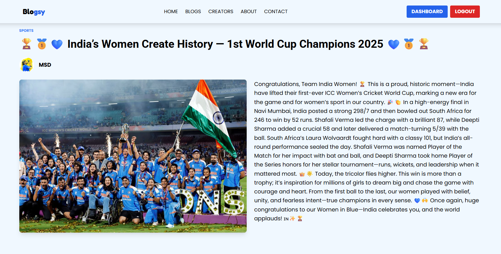
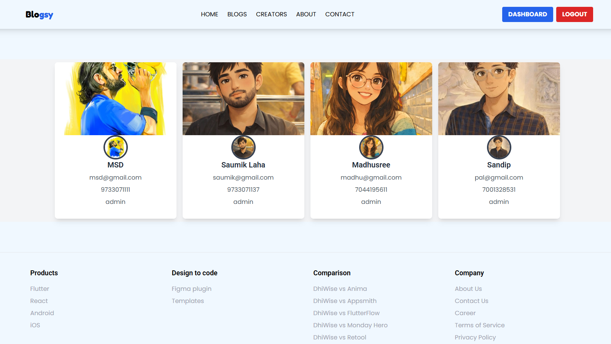
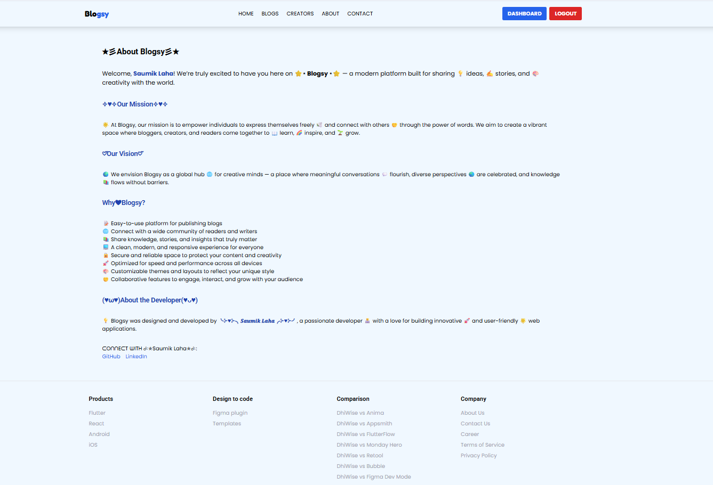
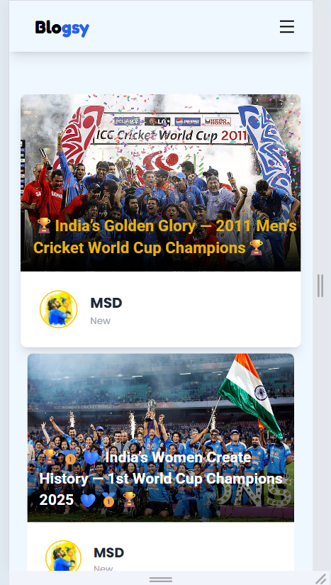
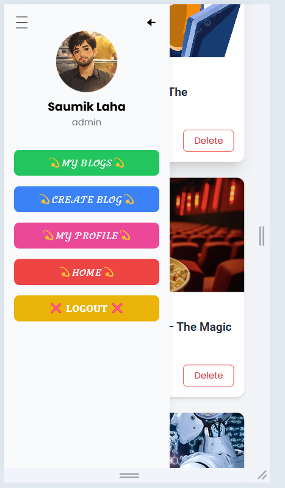

# 📝 𝓑𝓵𝓸𝓰𝓼𝔂 — 𝓜𝓔𝓡𝓝 𝓢𝓽𝓪𝓬𝓴 𝓑𝓵𝓸𝓰 𝓐𝓹𝓹 🌐

<p align="center">
  
  
  
  
  
  
  
  
  
  
</p>

---

## 📌 About the Project

🚀 **MERN Blog App** is a modern **full-stack blogging platform** built using the **MERN Stack**.

✨ Users can **browse and read blogs**, while **Admins** have full control to  
**create, update, and delete blog posts** with **image uploads powered by Cloudinary**.

🔐 The application demonstrates:
- Secure **JWT-based authentication**
- Complete **CRUD operations**
- **Role-based access control**
- **RESTful APIs**
- A clean and responsive UI using **TailwindCSS**

This project is built following **industry best practices** with **separated frontend & backend architecture**.

---

## ✨ Features

- 🔐 **User Authentication** (JWT-based Login & Registration)
- 📝 **Create, Edit & Delete Blogs** (Admin Only)
- 🖼️ **Image Upload & Management** with Cloudinary
- 👨‍💻 **Admin Dashboard** (My Blogs, Create Blog, Profile)
- 📱 **Fully Responsive UI** using TailwindCSS
- ⚡ **REST APIs** built with Express.js
- 📩 **Contact Form** powered by Web3Forms
- 🔔 **Real-time Notifications** using React Hot Toast
- 🧪 **API Testing & Debugging** with Postman
- 🗂️ **Scalable Architecture** (Frontend & Backend separated)

---

## 🛠️ Technologies Used

### 📂 Category
| Category |
|----------|
| 🎨 Frontend |
| ⚙️ Backend |
| 🗄️ Database |
| 🔐 Authentication |
| 🖼️ Image Storage |
| 📩 Form Handling |
| 🔔 Notifications |
| 🔧 Tools & Utils |

---
## 🛠️ Technologies Used

| Category | Tech Stack |
|----------|------------|
| 🎨 Frontend | React.js, TailwindCSS, Vite |
| ⚙️ Backend | Node.js, Express.js |
| 🗄️ Database | MongoDB (Mongoose ORM) |
| 🔐 Authentication | JWT (JSON Web Token) |
| 🖼️ Image Storage | Cloudinary |
| 📩 Form Handling | Web3Forms |
| 🔔 Notifications | React Hot Toast |
| 🔧 Tools & Utils | Axios, React Router, dotenv, Postman |


---

### 🖼️ Tools (Icons)
| Tool | Icon |
|------|------|
| React.js |  |
| TailwindCSS |  |
| Vite |  |
| Node.js |  |
| Express.js |  |
| MongoDB |  |
| JWT |  |
| Cloudinary |  |
| Web3Forms |  |
| React Hot Toast | 🔔 |
| Axios |  |
| React Router |  |
| dotenv | 🌱 |
| Postman |  |


---

## ⚙️ Installation & Setup

### 🔹 Clone the Repository
```bash

git clone https://github.com/SaumikLaha/your-repo-name.git
cd your-repo-name Blogsy_Web_App
```
### 🔹 Backend Setup
```bash

cd backend

npm install
```


#### Create a .env file inside /backend:
```bash

MONGO_URI=your_mongodb_connection_string

JWT_SECRET=your_jwt_secret

CLOUDINARY_CLOUD_NAME=your_cloud_name

CLOUDINARY_API_KEY=your_api_key

CLOUDINARY_API_SECRET=your_api_secret
```

### 🔹 Start backend server:
```bash

npm start

```

### 🔹Frontend Setup:
```bash

cd frontend

npm install

npm run dev

```
## 📸 Screenshots

<table>
  <tr>
    <th>Register</th>
    <th>Login</th>
    <th>Home</th>
    <th>Blogs</th>
    <th>Single Blog</th>
  </tr>
  <tr>
    <td></td>
    <td></td>
    <td></td>
    <td></td>
    <td></td>
  </tr>

  <tr>
    <th>Creators</th>
    <th>About</th>
    <th>Contact</th>
    <th>Mobile View 1</th>
    <th>Mobile View 2</th>
  </tr>
  <tr>
    <td></td>
    <td></td>
    <td></td>
    <td></td>
    <td></td>
  </tr>
</table>


## 🌍 Live Demo

🚧 Coming Soon...

(Live demo link will be added after deployment)


## 👨‍💻 Author

**SAUMIK LAHA**

[GitHub](https://github.com/SaumikLaha)  
[LinkedIn](https://www.linkedin.com/in/saumik-laha-530883381/)


